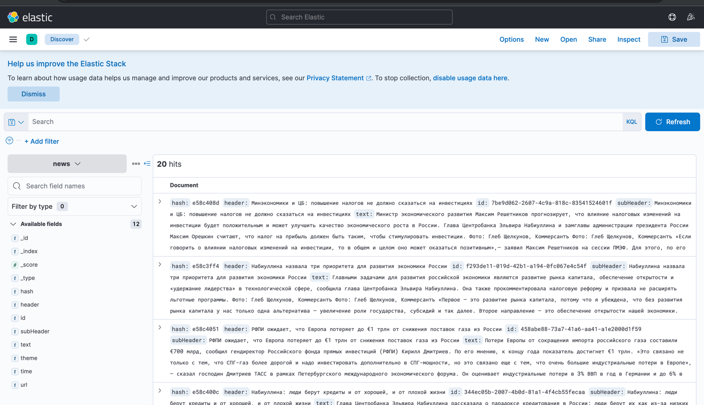

# Парсер новостного сайта

### Start docker
```
docker-compose -f docker-build/docker-compose.yml up -d
```

### Stop
```
docker-compose -f docker-build/docker-compose.yml down
```

### Описание программы
Новости парсятся с сайта https://www.kommersant.ru/archive/news

Есть 3 сервиса:
1) MainPageLinksGetter извлекает ссылки на новостные страницы, считает хэш от описания и урла, затем кладет в канал в rabbitMQ "parser_links"
2) NewsPageParser является консюмером для канала "parser_links", вычитывает новости которые нужно распарситmь, скачивает новостные страницы и извлекает из них:
   header (заголовок)
   subHeader (подзаголовок, он есть не везде)
   text (текст статьи)
   time (время публикации статьи)
   theme (тему статьи)

Затем новостная запись(модель) преобразуется в json строку и кладется в канал parser_news

3) NewsPageLoader является консюмером для канала parser_news, он добавляет полученные новостные записи в elasticSearch по индексу news

Все записи в elasticSearch:


Одна запись elasticSearch:


# Запросы и агрегации
### 1. OR 
```
POST /news/_search
{
  "query": {
    "bool": {
      "should": [
        {"match": {"text": "Набиуллина"}},
        {"match": {"time": "06.06.2024"}}
       ]
    }
  }
}
```

### 2. AND Query
```
POST /news/_search
{
  "query": {
    "bool": {
      "must": [
        {"match": {"text": "Набиуллина"}},
        {"match": {"time": "06.06.2024"}}
       ]
    }
  }
}
```

### Script Query
```
POST /news/_search
{
  "query": {
    "script_score": {
      "query": {"match_all": {}},
      "script": {
        "source": "return doc['text'].value.length() "
      }
    }
  }
}
```


### MultiGet Query
```
GET /news/_mget
{
  "docs": [
    { "_id": "AQOj7I8BDxmFdMvPlMxW" },
    { "_id": "CQOj7I8BDxmFdMvPlcza" }
  ]
}
```

### Histogram Aggregation
```
POST /news/_search
{
  "aggs": {
    "header_length_histogram": {
      "histogram": {
        "script": {
          "source": "doc['header'].value.length()",
          "lang": "painless"
        },
        "interval": 1
      }
    }
  }
}
```

### Terms Aggregation
```
POST /news/_search
{
  "aggs": {
    "themes": {
      "terms": {
        "field": "theme"
      }
    }
  }
}
```

### Filter Aggregation
```
POST /news/_search
{
  "aggs": {
    "filtered_body": {
      "filter": {
        "term": {"theme": "Экономика"}
      },
      "aggs": {
        "avg_summary_length": {
          "avg": {
            "script": {
              "source": "doc['text'].value.length()",
              "lang": "painless"
            }
          }
        }
      }
    }
  }
}
```

